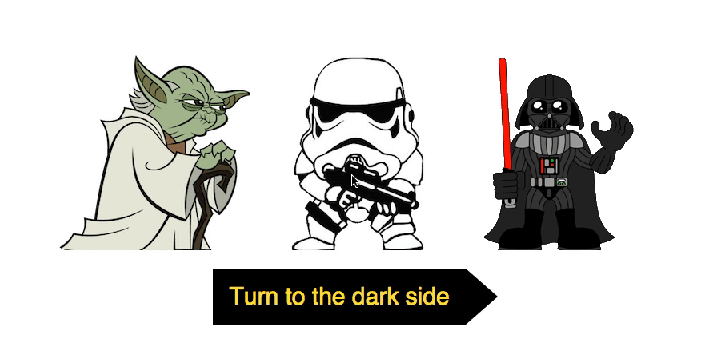
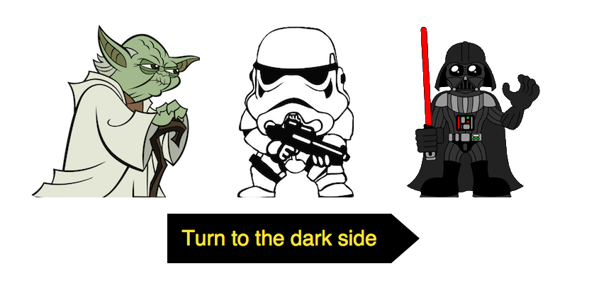
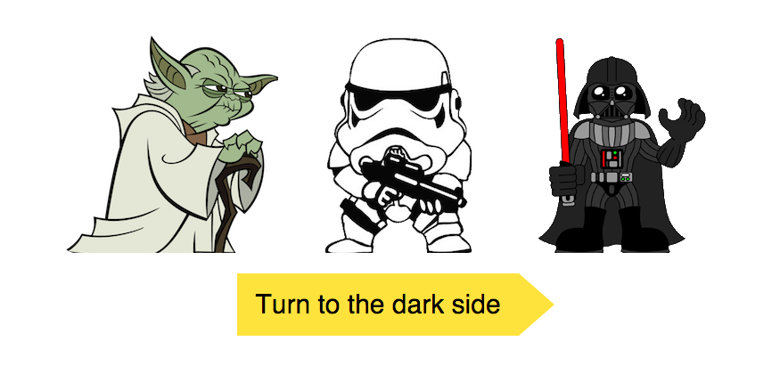
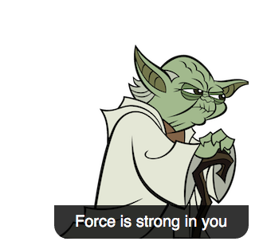
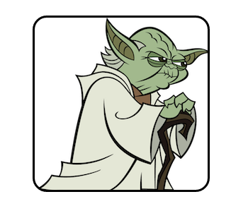

# Zadanie rekrutacyjne na stanowisko Junior Front-end Developer
## Ideamotiv sp. z o. o. (styczeń 2016)

### Opis
W pliku `zadanie/index.html` znajduje się prosty formularz html. Twoim zadaniem jest dodanie plików `zadanie/css/all.css` oraz
`zadanie/js/all.js`, które zmienią wygląd i zachowanie strony:

Wymagania dotyczące wyglądu (zmieniaj **TYLKO PLIK all.css**):

- formularz ma być wycentrowany w pionie i poziomie
- elementy listy wyboru (checkboxy) będą przedstawione jako ilustracje (pliki `zadanie/images`)
- zaznaczony element listy (checkbox) ma być udekorowany ramką (czarna, 3px szerokości) z zaokrąglonymi rogami (promień 20px)
- po najechaniu kursorem na element listy ma wyświetlić się tekst zawarty w parametrze data-sentence (tło rgba(0,0,0,0.8))
- przycisk formularza po najechaniu kursorem powinien zmieniać tło i kolor czcionki

Poniżej znajduje się screencast pokazujący spodziewany efekt oraz screenshoty z wybranymi stanami:

W przypadku, gdy gif nie działa proszę odwiedzić [http://d.pr/i/u8Jj](http://d.pr/i/u8Jj)

Wymagania dotyczące zachowania strony (zmieniaj **TYLKO PLIK all.js**):

Należy dodać funkcję, która będzie uruchomiona po wykryciu zdarzenia `submit` formularza. Funkcja ta ma sprawdzić, czy
zbiór zaznaczonych postaci jest niepusty oraz czy zawiera tylko postaci z "Ciemnej Strony Mocy". Jeżeli warunek będzie spełniony
powinna zostać odtworzony "Marsz Imperium" (plik `zadanie/imperial_march.mp3`), a wysłanie formularz powinno zostać zablokowane.
W razie niespełnienia warunków, funkcja powinna pozwolić na wysłanie formularza. Wszystkie przypadki opisuje poniższa tabelka:

| Yoda | Trooper | Vader | Akcja          |
|------|---------|-------|----------------|
|      |         |       | rickroll       |
| x    |         |       | rickroll       |
|      | x       |       | imperial_march |
|      |         | x     | imperial_march |
| x    | x       |       | rickroll       |
|      | x       | x     | imperial_march |
| x    |         | x     | rickroll       |
| x    | x       | x     | rickroll       |

### Uwagi

- Nie modyfikuj pliku `zadanie/index.html`, zmieniaj jedynie zawartość plików `zadanie/css/all.css` oraz `zadanie/js/all.js`.
- Możesz używać dołączonych bibliotek jQuery oraz Underscore.js.
- Rozwiązanie prześlij jako link do sklonowanego repozytorium na adres `praca@ideamotiv.com` z tytułem `[Zadanie rekrutacyjne][Rozwiązanie]  Imię Nazwisko`.
- Stwórz przynajmniej 2 commity (dla rozwiązania części css i js).
- Na rozwiązania czekamy do 18 stycznia do godziny 13.37.
- Kolejność nadesłania rozwiązań **NIE MA ZNACZENIA**
- Zadanie będzie sprawdzane na najnowszej wersji przeglądarki Google Chrome.
- Rozwiązanie **NIE** musi być RWD (wystarczy, że będzie działać w szerokości `> 1000px`.
- Oceniamy jedynie to, co jest w treści zadania. Wszelkie dodatkowe bajery nie będą brane pod uwagę.
- Ważna jest czytelność kodu i eleganckie rozwiązanie zadań.
- Każdej osobie, która prześle rozwiązanie damy odpowiedź zwrotną (z zaproszeniem do dalszego etapu lub rezygnacją) oraz przykładowe rozwiązanie.
- Autorem zadania jest Michał Ślaziński, w razie wątpliwości proszę o maila na adres `m.slazinski@ideamotiv.com` z tytułem `[Zadanie rekrutacyjne][Pytanie] Imię Nazwisko`.

Dziękujemy za zainteresowanie naszą ofertą i życzymy powodzenia!

